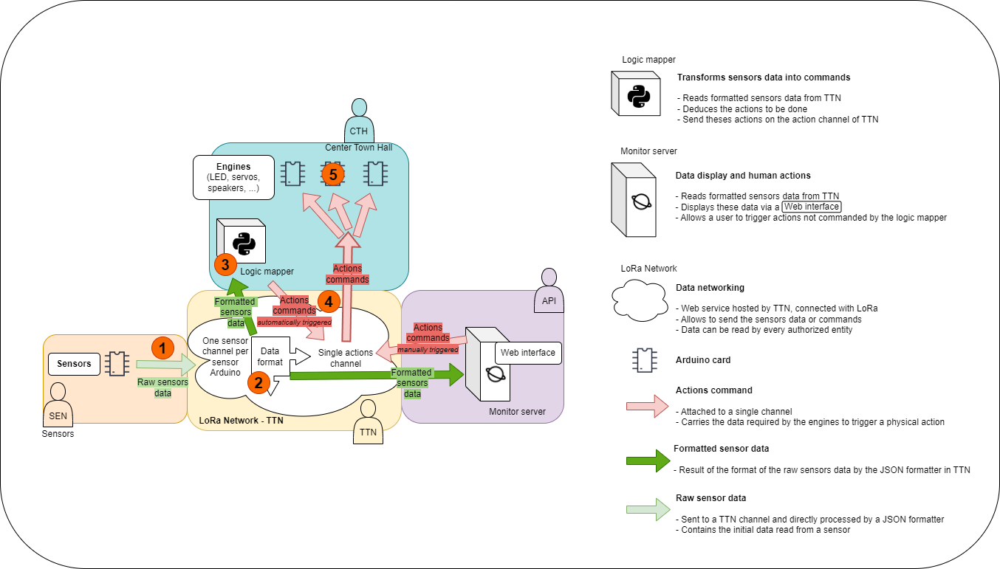
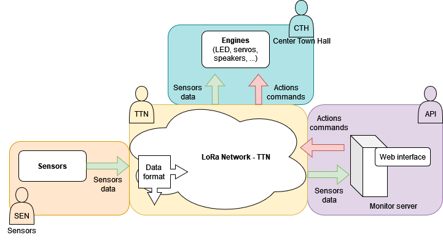

# XMas of Things

I think we should write a clear project description here.

## Updated technical design

First technical design is below this one.



## Initial technical design



### Teams details

#### SEN - Sensors team

In charge of reading values from various sensors, yet to be defined.
These values are then set on the LoRa network and handled by the TTN team.

#### API - API team

In charge of monitoring the values sent by the sensors, after they were formatted.
They will create a web interface, _probably using [Grafana](https://grafana.com/) 😉_ to display the data, and send action commands.

They're also in charge of defining standart behind "action command" sent to the engines of the CTH team, probably in accordance with the TTN team.

#### CTH - Center Town Hall team

Heart of the city actions, they drive the engines.
Will take sensors data and action commands as input and output live action using engines, such as LED, servos, speaker, etc.

#### TTN - TTN team

Format incomming data directly within the LoRa network so that the other team won't bother with different format and can refer to standarts defined here.

#### DES - Design team

In charge of the good-looking aspect of the village, including physical elements, decoration, architecture, etc.

## Work with Git and GitHub

You need to have `git` installed on your computer (`git bash` for Windows works just fine).

Clone the repo with `git clone git@github.com:lbo462/xmas-of-things.git`, 
after having a clean [SSH-key access set-up](https://docs.github.com/en/authentication/connecting-to-github-with-ssh/generating-a-new-ssh-key-and-adding-it-to-the-ssh-agent)

The other useful and only commands you'll ever need for this project are:
- `git add -v .` to stage your local changes
- `git commit -m "Your message"` to commit these changes
- `git push origin <your-branch>` to push your commit to GitHub

__Please__, make sure to __often__ commit and push your work on GitHub in order to avoid losses.

- `git fetch origin -v` to fetch changes and new branches from GitHub
- `git checkout <branch>` to change the current branch
- `git rebase master -i` to rebase your branch commits on the commits added to `master`

And these ones might be of use:
- `git status` the see a global view of changed files
- `git diff` to see in details what changed
- `git checkout .` to reset your changes to the previous commit. __To use carefully__ 

Here's the standard working process:

__Don't push to__ `master`.
Instead ...

- Create an issue at [https://github.com/lbo462/xmas-of-things/issues](https://github.com/lbo462/xmas-of-things/issues) and describe what needs to be done.

- Tag the issue with the label corresponding to the domain (sensors, api, ttn, center-town-hall or design)

- On this issue, create a branch (checkout locally), at the bottom right of the page (under the Development section).

- From now on, `git fetch origin -v` to fetch the created branch and `git checkout <branch>` to work on the given branch.
You can freely make commits and push to that branch to implement what's needed.

- From that issue and once you made changes, create a pull request at 
[https://github.com/lbo462/xmas-of-things/pulls](https://github.com/lbo462/xmas-of-things/pulls)
and select the branch created for the issue.

- Once your work is done, assign someone to review your work and approve your changes.

- Once approved, you can __squash and merge__ your branch via the pull request you created into the master branch.

### Rebase

Rebasing is the tricky part of this process.

It's required when some changes happened on `master` after you created your branch.
One way to solve this would be to solve merge conflict but it might be complex and
won't always work as expected if done via GitHub.

Instead, we propose here to rebase the incoming branch.

Before going any further, it is required to pull the last changes from `master`.
To do so:

```shell
git checkout master
git pull origin master
git checkout <your-branch>
```

Now you can proceed with `git rebase master -i` and follow the interactive documentation.

This process replays your branches commits from `master` so there's can't be conflict 
when merging the two branches and one keep a linear commit history.

Once the rebase is done, just push your branch to GitHub and have someone review your
changes.
