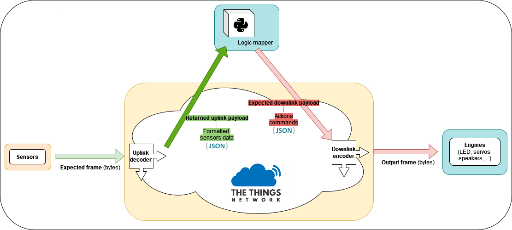

# TTN Documentation



To put things simple:
- Sensors are sending sensors data as bytes on the Uplink topic
- These are decoded with the Uplink decoder into JSON
- The logic mapper fetches this sensors data as JSON and sends actions commands as JSON on the downlink topic
- These are encoded with the Downlink encoder into bytes
- Engines read the downlink topic to retrieve this frame of action commands.

__Standard are detailed below!__

## From SEN to TTN

### Expected frame

```
+-----------------------+--------------------+
| Temperature (4 bytes) | Humidity (4 bytes) |
+-----------------------+--------------------+
```

### Uplink decoder

```js
function decodeUplink(input) {
 let temperature =
 (input.bytes[3] << 24) |
 (input.bytes[2] << 16) |
 (input.bytes[1] << 8) |
 (input.bytes[0]);
 
 let humidity =
 (input.bytes[7] << 24) |
 (input.bytes[6] << 16) |
 (input.bytes[5] << 8) |
 (input.bytes[4]);
 
 return {
   data : {
     humidity: humidity,
     temperature: temperature
   }
 };
}
```

### Returned uplink payload

```json
{
  "humidity": 1,
  "temperature": 1
}
```

## From TTN to CTH (engines)

### Expected downlink payload

```json
{
    "action_id": 1,
    "human_name": "DESCRIPTION"
}
```

### Downlink encoder

```js
function encodeDownlink(input) {
  return {
    bytes: [input.data.action_id],
    fPort: 1,
    warnings: [],
    errors: []
  };
}
```

### Output frame

```
+--------------------+
| action_id (1 byte) |
+--------------------+
```
